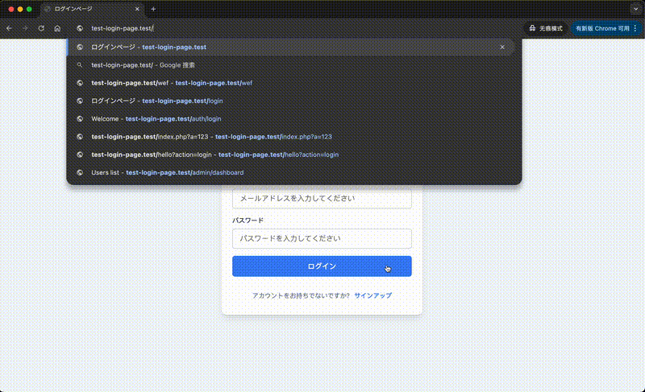
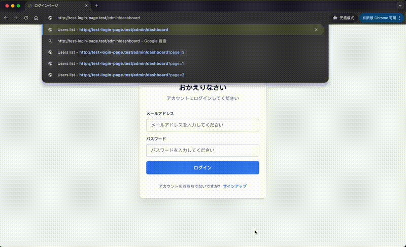
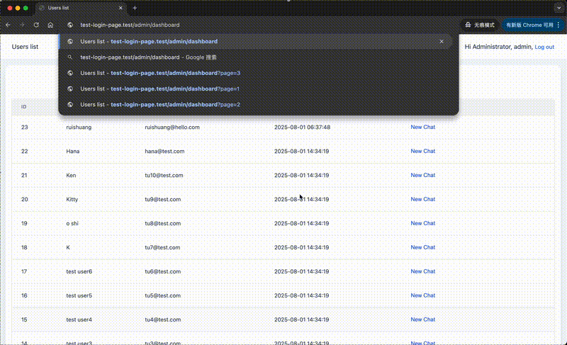
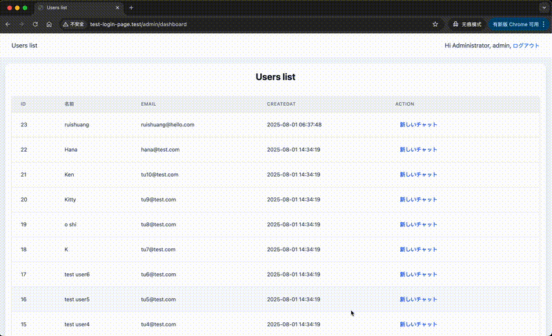
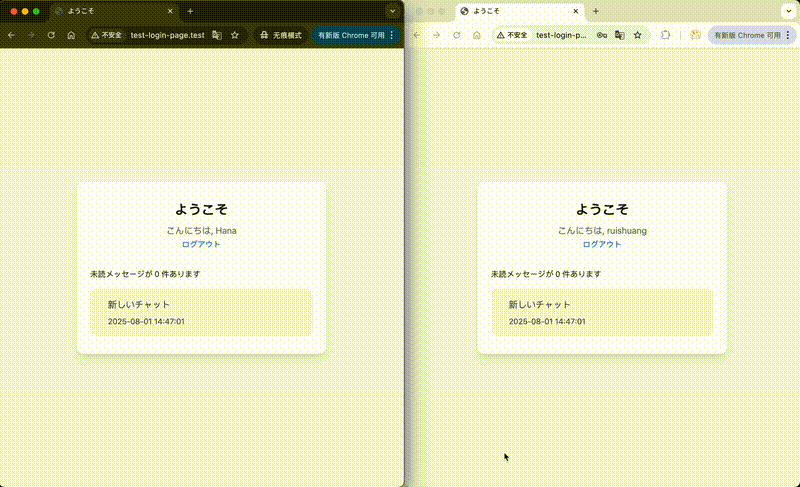
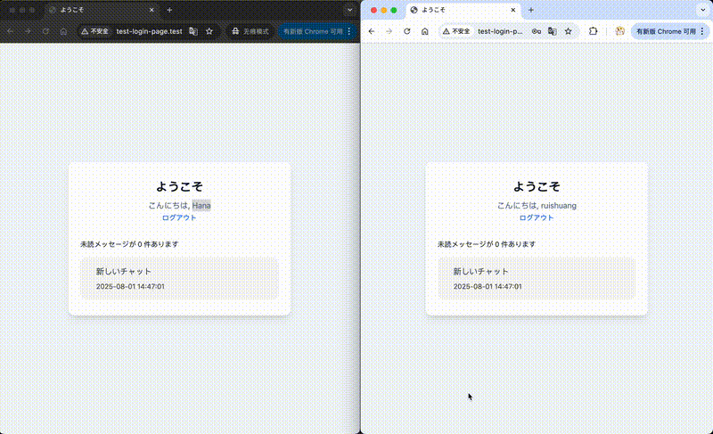
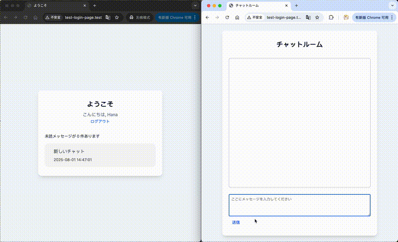
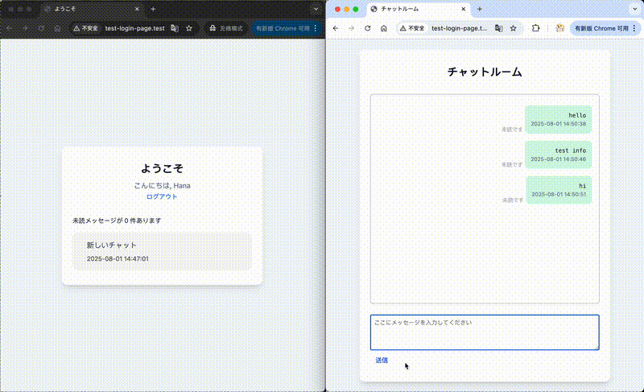
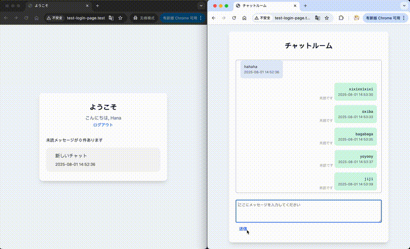

# Test Login Page Project Structure

## Code Structure

- Admin `Management System Business Logic Code`
    - Controllers `Controller layer code`
        - Controller.php    `Abstract controller with common method implementations`
        - DashboardController `Dashboard Page Controller Layer`
        - ChatController.php `Chat Page Controller Layer`
    - Models `Model layer code`
      - BaseModel.php `Abstract Model with common method implementations`
      - AdministratorModel.php `Model layer related to administrators`
      - ChatModel.php `Model layer related to the administrator operation chat`
- App `Business application logic code`
    - Controllers `Controller layer code`
        - Controller.php    `Abstract controller with common method implementations`
        - AuthController.php  `Auth-related controller logic (login, logout, registration)`
        - HomeController.php  `Business Logic Code Controller Layer`
        - ChatController.php  `User's Chat Page Controller Layer`
    - Models  `Model layer code`
        - BaseModel.php  `Abstract Model with common method implementations`
        - UserModel.php  `User-related Model methods (database operations)`
        - ChatModel.php  `User-related Chat functions`
- Tools  `Utility classes`
    - Auth.php  `Permission Verification Related Method Encapsulation`
    - Config.ini.php
      `Config Template - Please copy this file as Config.php and modify the corresponding configurations`
    - Config.php  `Project configuration class (static properties). Access via Config::database etc.`
    - Database.php  `Database class wrapper (PDO singleton and common method implementations)`
    - Language.php
      `Multi-language configuration. Configure language mappings (English as key) and set language in index.php entry point`
    - Router.php   `Routing Configuration Related Method Encapsulation`
    - Utils.php   `Utility class (currently includes IP address and UserAgent retrieval methods)`
    - Validator.php   `Parameter Validation Related Method Encapsulation`
- views  `Frontend code`
    - basic
        - head.view.php  `Common header template`
        - foot.view.php  `Common footer template`
    - errors
        - 404.view.php    `404 Page`
        - 500.view.php    `Server 500 Error Page`
    - admin
      - dashboard.view.php  `Admin dashboard page template`
    - home.view.php  `Home page template (after login)`
    - login.view.php  `Login page template`
    - register.view.php  `Registration page template`
    - chat.view.php   `User chat room page`
- public  `Public directory (web root)`
    - index.php
      `Application entry point (request routing, function declarations, language setup, business logic invocation)`
    - assets
        - js  `JavaScript files`
            - chat
              - create.js   `Create javascript related to chat interaction logic`
              - dialog.js   `js logic related to the chat window`
              - list.js     `Chat list-related js`
            - auth.js  `Auth-related JavaScript logic`
        - css  `CSS files`
            - styles.css  `All style definitions`
- table.sql  `Database schema SQL file`
- Static     `Some images for readme file, ***Unrelated*** to code`
- readme.md  `Project documentation`

### about administrator
> Administrators also have independent tables for storage, but for the convenience of testing, you can log in with the account 'admin' and the password 'admin', which is hardcoded in the code.
> 
> After entering the administrator list, you can subsequently add an administrator management module. At that time, you can perform operations such as "viewing", "adding", and "restricting" on administrators

## Function demonstration
### User registration

### User login

### Administrator permission verification, can view all the user lists

### The administrator can view all users by turning pages

### Administrators can select two users to initiate a chat

### After logging in, the user's home page displays a list of all chats

### Clicking on a single session will redirect you to the chat room page

### After entering the content, click the Send button or press `shift + entry` to send the message

### After the other party reads the message, the message status will be automatically updated to "read"

### Click the button at the top to get more historical messages
